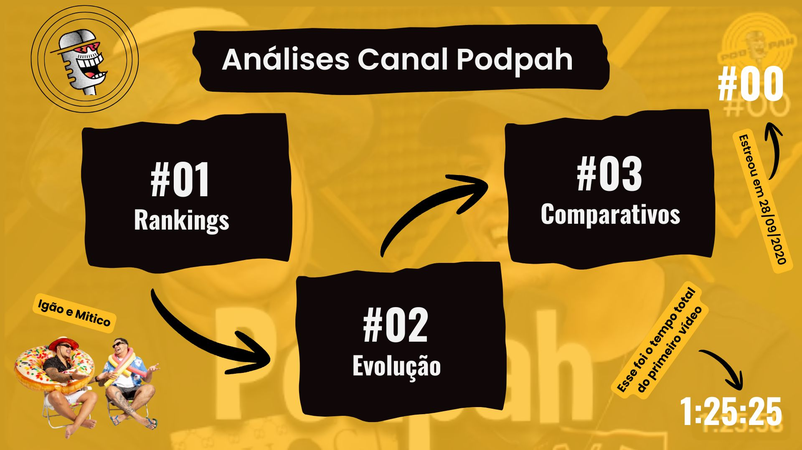
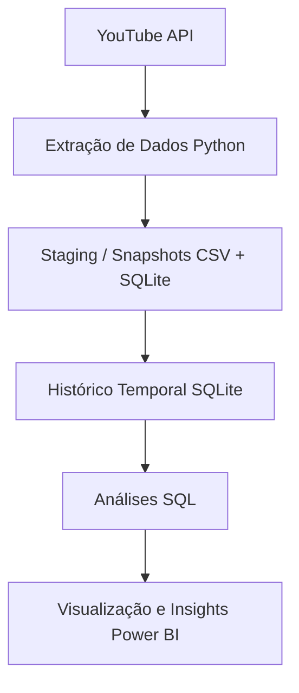
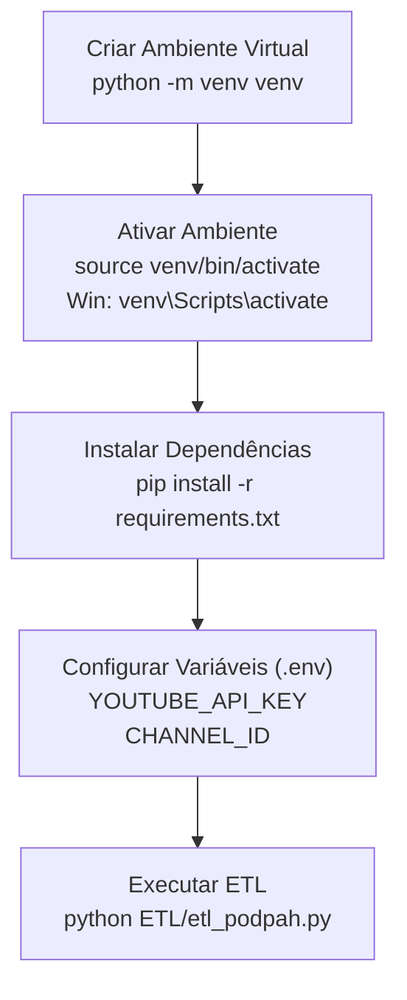

# Análise de Dados do Canal Podpah (YouTube) 

Status do projeto: Em desenvolvimento<br> 
Última atualização: 22/01/2026<br>
Autor: Lucas Gonzaga (gzga)<br>

## Objetivo do Projeto 

Este projeto tem como objetivo construir um pipeline de dados completo (ETL) para coletar, organizar, armazenar e    analisar dados do canal Podpah no YouTube, utilizando:

- Python para extração e automação
- SQL para organização, modelagem e análises estruturadas
- Power BI para visualização e geração de insights

## Status Atual – Projeto Vivo

- Este é um projeto em constante evolução para prática e aprendizado constante

## Onde estou atualmente

- Refinando análises exploratórias
- Desenvolvendo novas métricas de engajamento
- Evoluindo dashboards no Power BI
- Aprimorando a modelagem analítica dos dados

## Arquitetura do Projeto (ETL)

O pipeline segue uma arquitetura inspirada em ambientes reais de dados como demostrado no diagrama abaixo:



## Principais características:

- Coleta automatizada via API do YouTube
- Controle de quota da API
- Retry automático para falhas temporárias
- Logging completo de execução
- Histórico acumulado para análises temporais
- Separação clara entre código, dados e análises

## Tecnologias Utilizadas:

- Python
- pandas
- sqlalchemy
- google-api-python-client
- logging
- dotenv
- SQL (SQLite)
- Power BI
- Git & GitHub para versionamento

## Organização:

```text
📁 projeto-podpah
├── ETL/        # Código do pipeline de dados
├── SQL/        # Consultas e análises em SQL
├── Dados/      # Dados locais (ignorados no Git)
├── backups/    # Snapshots históricos
├── logs/       # Logs de execução
├── PowerBI/    # Dashboards e imagens
├── Docs/       # Documentação adicional
├── .gitignore
├── README.md
└── requirements.txt

Obs: Arquivos sensíveis, dados locais e chaves de API não são versionados
```

## Diagrama de execução do Projeto:



## Análises em Desenvolvimento:

- Evolução de views ao longo do tempo
- Engajamento (likes + comentários / views)
- Performance por duração de vídeo
- Comparação entre períodos (semestral/anual)
- Ranking de vídeos por métricas-chave

## Próximos Passos Planejados:

- Refinar modelo analítico (camada curada)
- Criar views SQL para métricas avançadas
- Expandir dashboards no Power BI
- Documentar insights encontrados
- Automatizar execuções periódicas

## Considerações Finais
 
- Este projeto faz parte do meu portfólio de dados e representa um estudo prático de ETL, engenharia de dados e análise analítica, aplicado a um cenário real

- Feedbacks, sugestões e melhorias são bem-vindos!